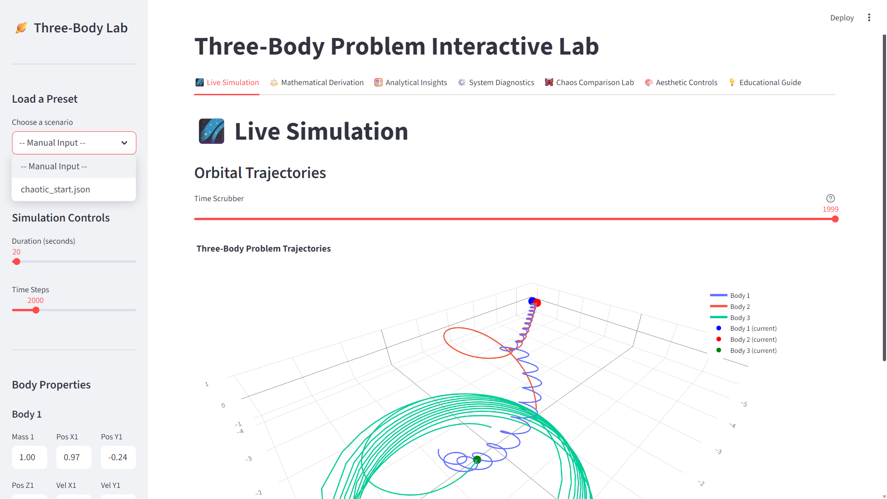
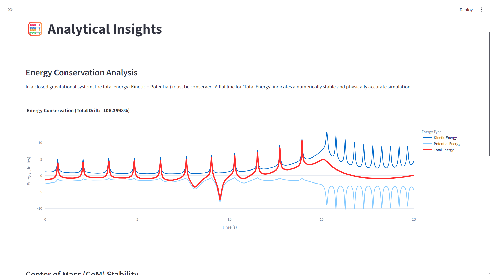
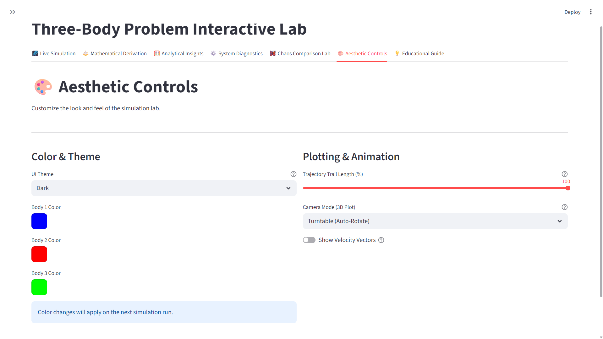
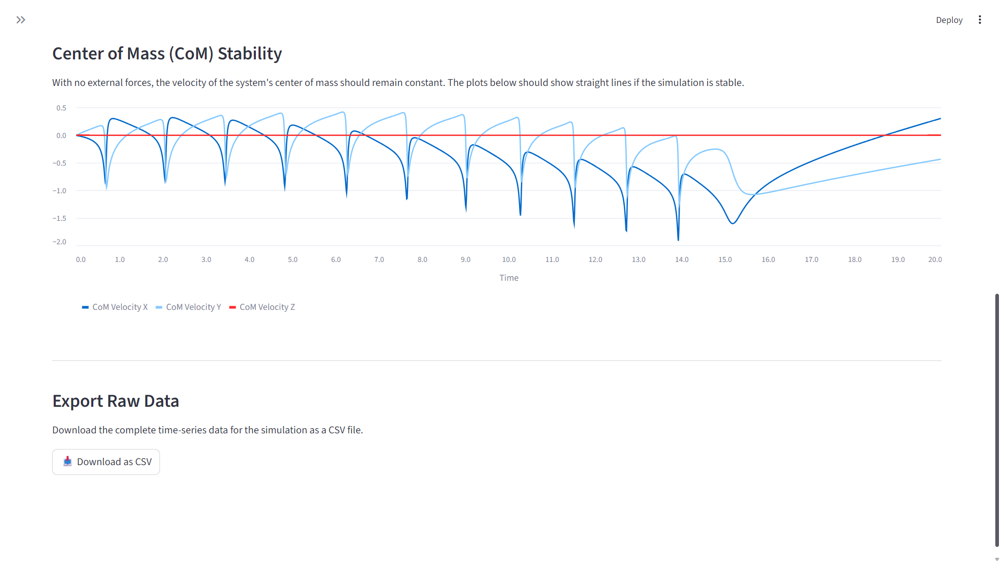
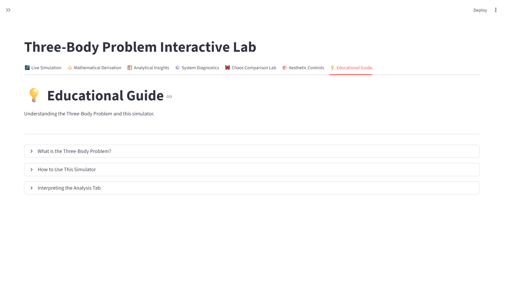
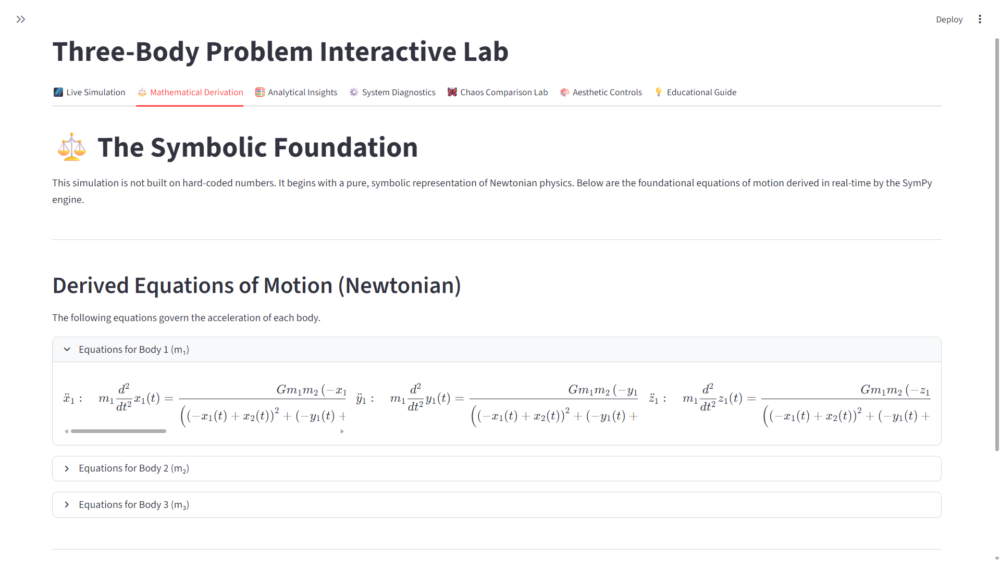
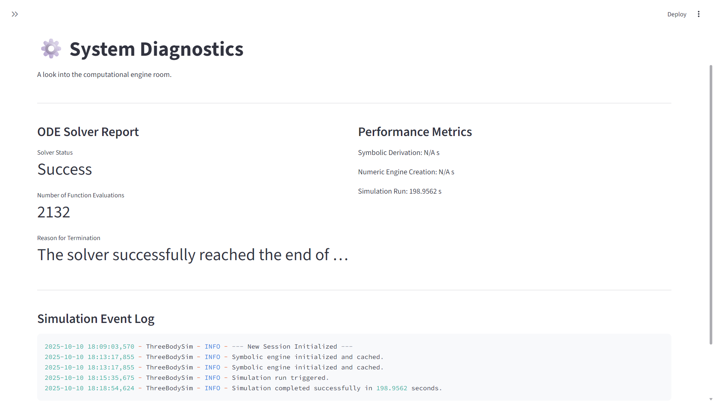
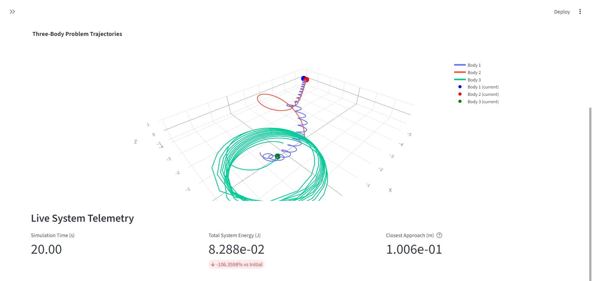

# 🌌 **`Project`: _Celestial Ballet_** 
<div align="center">
  
### ✨ `Three-Body Simulation`: **“The project uses `SymPy` and `PyDy` Liberies of Python.”** <br>


</div>

<br>


<br>



> 🚀 **Project provides a `minutely, interactive simulation environment` for exploring the `three-body problem` under mutual gravitational attraction.**

>🌍 **_Simulator_ has a powerful _symbolic-to-numeric workflow_, It uses `SymPy` library to mathematically derive the exact differential equations of motion from `first principles`.**

>⚙️ **These symbolic expressions are then converted into _optimized NumPy functions_ that are solved over time using high-performance ordinary differential equation integrators from `SciPy`.** 


---

<br>

<div align="left">

# 🗂️ Project Structure

<br>

</div>

```markdown-tree
📁 three_body_lab/
├── main.py                        
├── config.yaml                    
├── requirements.txt                
└── README.md                       
|
├── 📁 core/                         # --- Core Simulation & Physics Logic ---
│   ├── symbolic_setup.py           
│   ├── equations_builder.py        
│   ├── system_converter.py         
│   ├── numeric_engine.py           
│   ├── state_manager.py            
│   ├── chaos_tools.py              
│   └── data_logger.py              
│
├── 📁 ui/                           # --- Streamlit User Interface Layer ---
│   ├── dashboard.py                
│   ├── sidebar_controls.py         
│   ├── tab_simulation.py           
│   ├── tab_equations.py            
│   ├── tab_diagnostics.py          
│   ├── tab_analysis.py             
│   ├── tab_comparison.py           
│   ├── tab_aesthetic.py            
│   └── tab_educational.py          
│   │
│   └── 📁 components/               
│       ├── live_metrics.py         
│       ├── equations_viewer.py     
│       └── parameter_sliders.py    
│
├── 📁 utils/                        # --- General Helper Functions ---
│   ├── latex_utils.py              
│   ├── visualization_tools.py      
│   ├── performance_monitor.py      
│   ├── config_loader.py            
│   └── math_utils.py               
│
├── 📁 tests/                        # --- Unit & Integration Tests ---
│   ├── test_symbolic.py           
│   ├── test_numeric.py             
│   ├── test_state_manager.py      
│   ├── test_ui_sync.py             
│   └── test_data_integrity.py     
│
├── 📁 data/                         # --- Stored Simulation Data ---
│   ├── 📁 presets/                  
│   └── 📁 logs/                     
│
└── 📁 assets/                       
```

<br>


<div align="left">

# ⚙️ **Customization / Parameters**


</div>

---

<div align="left"; style="display: flex; align-items: flex-start; justify-content: space-between; gap: 30px; flex-wrap: wrap;">

  <!-- LEFT SIDE -->
  <div style="flex: 1; min-width: 320px;">

  <h3>🌌 <b>Physical Parameters</b></h3>

  <ul>
    <li><b>Preset Scenarios</b> — Instantly load well-known configurations like the stable <code>figure_eight.json</code> orbit.</li>
    <li><b>Body Masses</b> — Individually define the mass for each of the three celestial bodies (m₁, m₂, m₃).</li>
    <li><b>Initial State Vector</b> — Precisely set the starting 3D coordinates and velocity vectors for each body.</li>
    <li><b>Simulation Duration</b> — Control the total time the simulation runs, defining the length of the trajectory.</li>
    <li><b>Time Steps</b> — Adjust the number of integration points, trading resolution for computational speed.</li>
  </ul>

  <h3>🎨 <b>Aesthetic Controls</b></h3>

  <ul>
    <li><b>Body Colors</b> — Assign a unique color to each body for clear visual tracking in the 3D plot.</li>
    <li><b>Trail Length / Persistence</b> — Adjust the percentage of the past trajectory that remains visible on screen.</li>
    <li><b>Camera Mode</b> — Select the 3D camera behavior: <code>Static</code>, <code>Auto-Rotate</code>, or <code>Follow Body</code>.</li>
    <li><b>Velocity Vectors</b> — Toggle the display of vector arrows on each body to visualize their current momentum.</li>
  </ul>

</div>
</div>

---

<div style="text-align: center;">

### 🔬 **Analytical & Experimental Settings**

| Parameter | Description | Location |
|:------------|:--------------|:----------------|
| `Perturbation Magnitude` | Scalar size of the ε-perturbation for the chaos experiment. | `Chaos Lab Controls` |
| `Energy Analysis Plot` | Displays real-time energy conservation and drift analysis. | `Analytical Insights` |
| `Center of Mass Analysis` | Plots the velocity of the system's CoM to verify stability. | `Analytical Insights` |
| `Data Export` | Allows downloading the full simulation trajectory data. | `Analytical Insights` |
| `Log File Viewer` | Displays the raw, timestamped event log from the engine. | `System Diagnostics` |

</div>

---


<br>


---

<div align="left">

# 🚀 Getting Started


</div>

---

### **📋 1. Prerequisites**

Before you begin, ensure you have the following essential tools installed on your system.

*   **Python 3.8+**: The core programming language.
*   **Git**: For cloning the repository.
*   `pip` and `venv`: Standard Python package and environment managers.

---

### **⚙️ 2. Installation & Setup**

This step-by-step guide will set up the entire project environment. Open your terminal or command prompt and execute the following commands.

**1. Clone the Repository**  
First, clone this repository to your local machine.

```bash
git clone https://github.com/Sairaj213/Celestial_Ballet.git
```

**2. Navigate to the Project Directory**  
Change into the newly created folder.

```bash
cd three_body_lab
```

**3. Create and Activate a Virtual Environment**  
This is a crucial best practice that isolates the project's dependencies from your system-wide Python installation.

*   **On Windows:**
    ```bash
    python -m venv venv
    venv\Scripts\activate
    ```
*   **On macOS / Linux:**
    ```bash
    python3 -m venv venv
    source venv/bin/activate
    ```
    *(Your terminal prompt should now be prefixed with `(venv)`)*

**4. Install Required Dependencies**  
This single command reads the `requirements.txt` file and installs all necessary libraries (Streamlit, SymPy, NumPy, etc.) into your virtual environment.

```bash
pip install -r requirements.txt
```

---

### **🛰️ 3. Launch the Simulator!**

With the setup complete, you are now ready to launch the application.

```bash
streamlit run main.py
```

Your default web browser will automatically open a new tab containing the **Three-Body Interactive Lab**. The symbolic engine will initialize on the first run, and then you are free to explore the cosmos.

# 📷 Sample Images 







